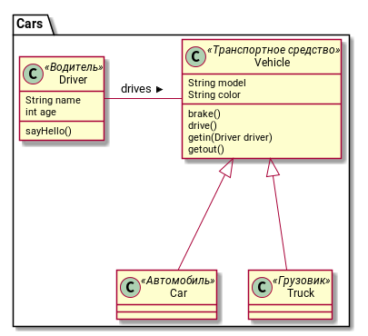
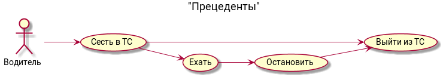

# Тачки

## Задание

Реализовать предметную область на произвольном программирования (Например Python, PHP, Javascipt).

### Диаграмма классов


### Прецеденты использования


### Критерии приемки

Написать юнит-тест, выводящий следующий текст:

```
Привет, меня зовут Петр
Я lada granta, в меня сел Петр!
Я lada granta, я еду!
Я АВТОМОБИЛЬ lada granta, я торможу БЫСТРО!
Я lada granta, из меня вышел Петр!
Я Газель, в меня сел Петр!
Я Газель, я еду!
Я ГРУЗОВИК Газель, я торможу МЕДЛЕННО!
Я Газель, из меня вышел Петр!
```

Пример теста на языке Python

```python
p1 = Person("Петр", 36)
print(p1.sayhello() )
    
c1 =  Car("lada granta","зеленый")

print(c1.getin(p1))
print(c1.drive())
print(c1.brake())
print(c1.getout())


t1 =  Truck("Газель","серый")

print(t1.getin(p1))
print(t1.drive())
print(t1.brake())
print(t1.getout())
```
## Языки програмирования
Попробуйте сделать задание и [юнит-тест](https://jestjs.io/docs/en/getting-started.html) на Javascript, используя классы ECMAScript 6 (ES-2015)

## Материалы

1. [Предметно-ориентированное программирование](https://ilb.github.io/devmethodology/ddd.xhtml)
2. [Классы в Python](https://python-scripts.com/python-class)
